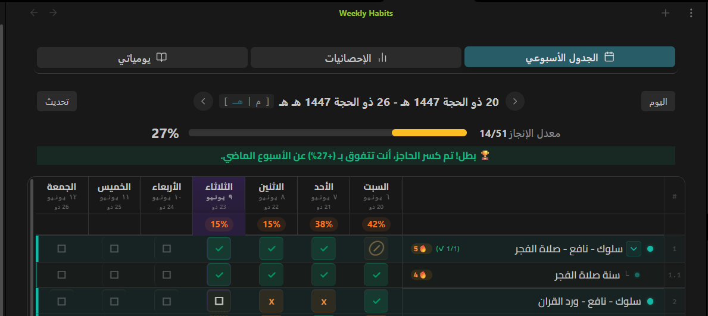
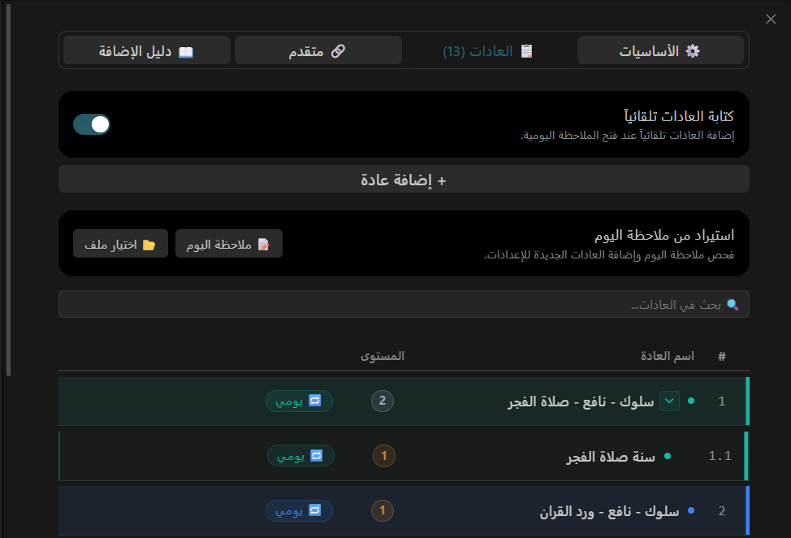
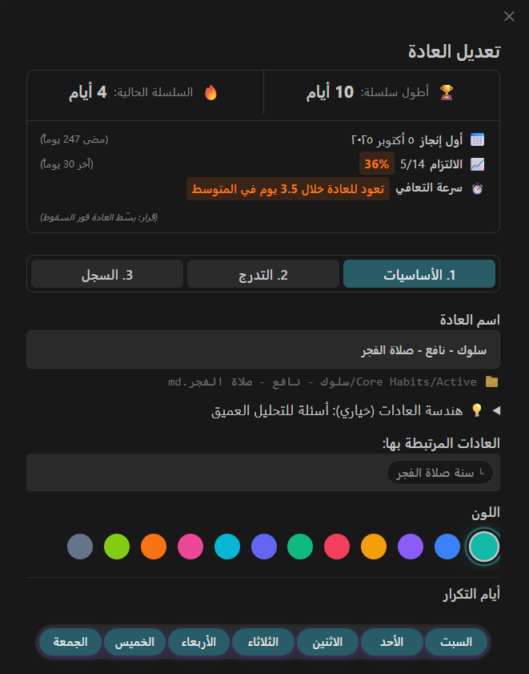

# Core Habits 🔥

Core Habits is a powerful, visual, and highly optimized habit tracker plugin for Obsidian. It natively integrates with your knowledge base to help you build consistency, track your progress, and maintain your "Core Path" directly within your daily notes.

## Why Core Habits?

Unlike other trackers that lock your data in complicated databases, Core Habits reads and writes standard Markdown checkboxes directly to your daily notes. This means your data is future-proof, 100% offline, and fully yours.

### ✨ Key Features

- **Blazing Fast Weekly Dashboard**: A clean, responsive week-based grid that lets you toggle habits instantly without lag or UI flickering.
- **Smart Streak System (🔥)**: Accurate streak calculation that goes back in time to find your true "First Completion Date" and longest streaks without double-counting.
- **Dynamic Hijri & Gregorian Dates**: Seamlessly toggle between language-aware dates (e.g., displaying "Ramadan" or "رمضان" based on your interface language).
- **Audio & Text Context**: Record voice memos or write quick thoughts directly inside a specific habit's record, tying your reflections intimately with your actions.
- **Atomic Operations**: Modifies files safely in the background, reading cached data to prevent memory leaks and keep your Obsidian vault fast.

## Screenshots

### Comprehensive Habit Settings
Organize, nest, and color-code your habits effortlessly. Add related cues and routines to build "Atomic Habits".

### Deep Habit Insights
Monitor your performance over the last 30 days, track recovery speed after a broken streak, and see your all-time records.

### Embedded Audio Notes
Reflect on your progress or failures by attaching quick audio voice notes or text entries directly to your habits.

## Local-First Privacy Policy

**100% Offline and Private.**
Core Habits was built with privacy as a foundational principle.
- It does **not** collect telemetry, analytics, or user behavioral data.
- It operates entirely on your local device without any external network connections.
- Your personal habit data never leaves your vault.

## Manual Installation

1. Navigate to the [Releases](https://github.com/Ahmed-Farhat99/core-habits/releases) page.
2. Download `main.js`, `manifest.json`, and `styles.css` from the latest release.
3. Move these three files into your vault's plugin directory: `<vault>/.obsidian/plugins/core-habits/`.
4. Reload the Obsidian plugins list and enable Core Habits.

## Using the Plugin

1. Use the **Core Habits: Open Weekly Dashboard** command to open the main tracker.
2. Click **Add New Habit** from within the dashboard to set up your schedule, custom visuals, and atomic cues.

---
Built with passion for productivity.
