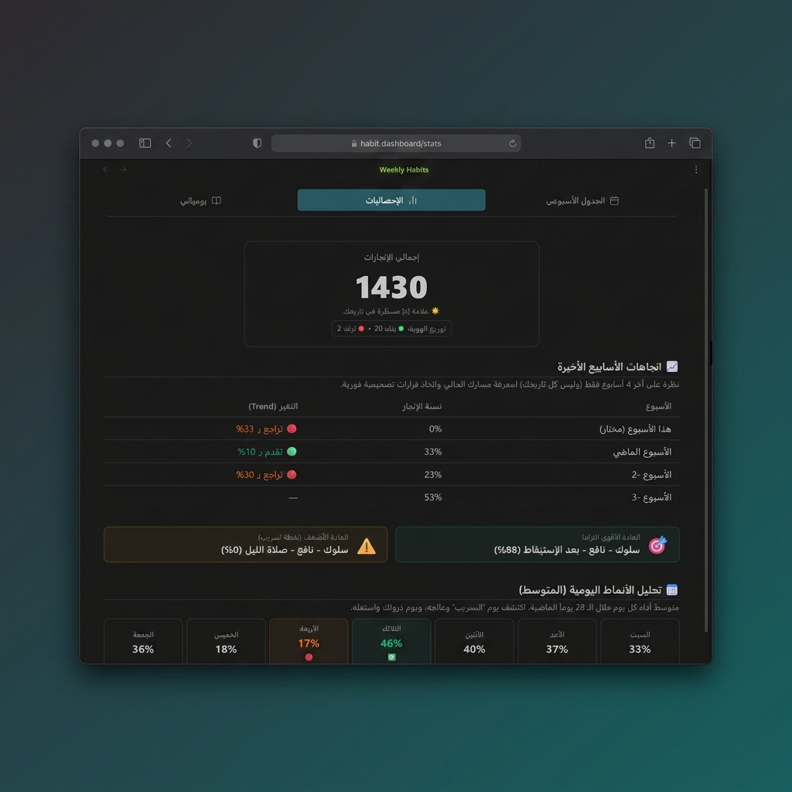
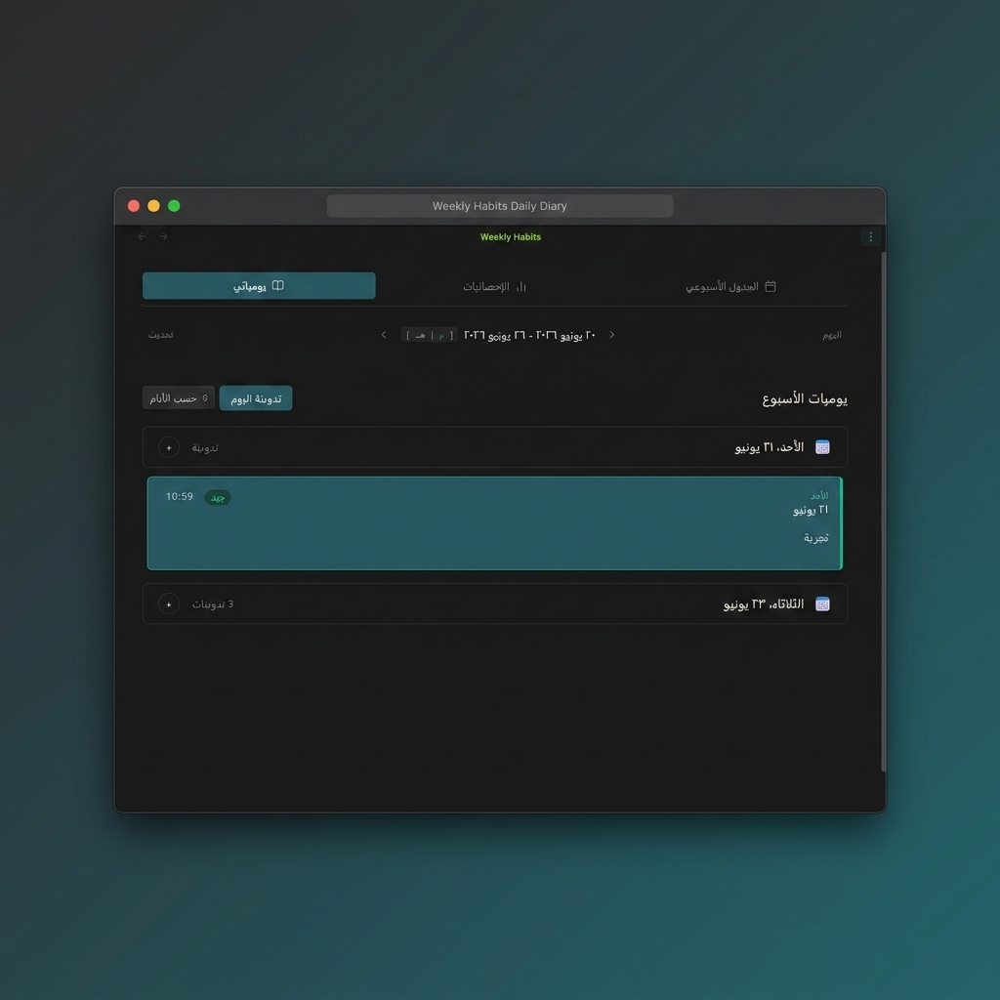

# Core Habits 🔥

Core Habits is a visual, privacy-first, and highly optimized habit tracker designed to help you build consistency and shape your identity directly inside Obsidian.

Unlike complex database-heavy trackers, Core Habits integrates seamlessly with your existing **Daily Notes** using standard Markdown checkboxes (`- [ ]`). Your data remains future-proof, 100% offline, and entirely yours.

---

## Why Core Habits?

Most habit trackers lock your progress in proprietary databases or cluttered JSON blocks. Core Habits treats your **Markdown files as the single source of truth**. 

When you toggle a habit on the visual dashboard:
1. It automatically finds or creates your daily note.
2. It writes standard Markdown checkboxes in a clean, human-readable section.
3. It keeps your vault fast by relying on local cache and atomic, non-blocking file operations.

It’s local-first productivity, built the Obsidian way.

---

## ✨ Key Features

### 📅 Elegant Weekly Grid & Adaptive Layout
* **Visual Dashboard**: A clean, distraction-free weekly grid to track all scheduled habits in one screen.
* **Responsive Sidebar & Mobile Views**: Automatically switches to an optimized compact layout when dragged to the sidebar or opened on mobile devices.
* **Hierarchical Nesting (Parent-Child)**: Group related habits (e.g., *Morning Routine* -> *Read*, *Meditate*) with automatic progress tracking and folding/collapsing support.

### 🗺️ Dual Calendar Support (Gregorian & Hijri)
* **Localized Dates**: Display dates in Gregorian or Hijri format, fully localized in both English and Arabic.
* **Smart Scheduling**: Custom schedules for each habit (specific days of the week, weekends, or daily) with non-scheduled days clearly marked (`--`).

### ⚡ Smart Streak System & Analytics
* **Historical Accuracy**: Calculates streaks, recovery speeds, and lifetime metrics by scanning past daily notes.
* **No Double Counting**: Robust algorithms ensure streaks are accurate even when habits are renamed.

### 🎙️ Audio Reflections & Rich Context
* **Voice Memos**: Record audio thoughts and reflections directly within a habit's popup and embed them in your note.
* **Daily Comments**: Write notes or log thoughts attached to specific completions, keeping your reflections intimately tied to your actions.

---

## 📸 Screenshots

### 📊 Deep Habit Insights & Statistics
Monitor your performance trends over the last 4 weeks, track daily completion patterns, and analyze consistency metrics.

### ✍️ Daily Diary & Reflections
Add written thoughts or voice recordings connected directly to your habits, keeping a rich journal of your daily progress.

### 🛠️ Comprehensive Habit Settings
Organize, color-code, and sequence your habits. Define routines and atomic cues to build a sustainable daily system.

---

## 🔒 Local-First Privacy Policy

* **100% Offline**: Core Habits operates entirely on your local machine.
* **No Telemetry**: No tracking, no analytics, no external network calls.
* **Vault Privacy**: Your habit logs and audio files never leave your Obsidian vault.

---

## 🛠️ Installation

### Manual Installation
1. Go to the [Releases](https://github.com/Ahmed-Farhat99/core-habits/releases) page on GitHub.
2. Download `main.js`, `manifest.json`, and `styles.css` from the latest release.
3. Create a folder named `core-habits` under your vault's plugins directory: `<vault>/.obsidian/plugins/core-habits/`.
4. Copy the downloaded files into that folder.
5. Open Obsidian settings, head to **Community plugins**, and enable **Core Habits**.

---

## 🚀 How to Use

1. Run the command `Core Habits: Open Weekly Dashboard` (via `Ctrl/Cmd + P`) to open the tracker.
2. Click **Add New Habit** to customize your schedules, colors, parent relationships, and cues.
3. Toggle habits directly on the grid. Daily notes will be updated/created automatically in the background.
