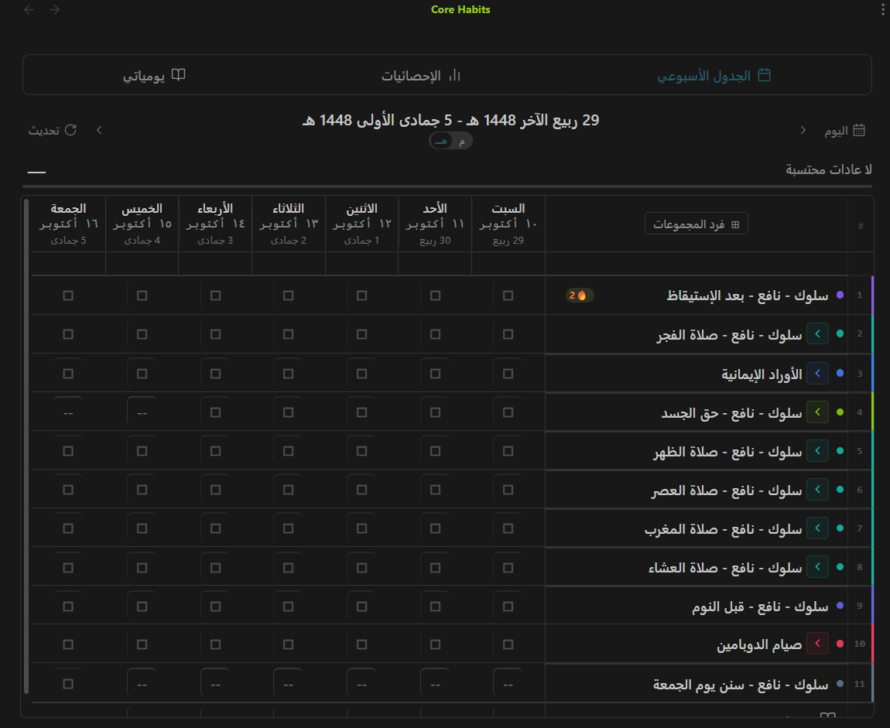
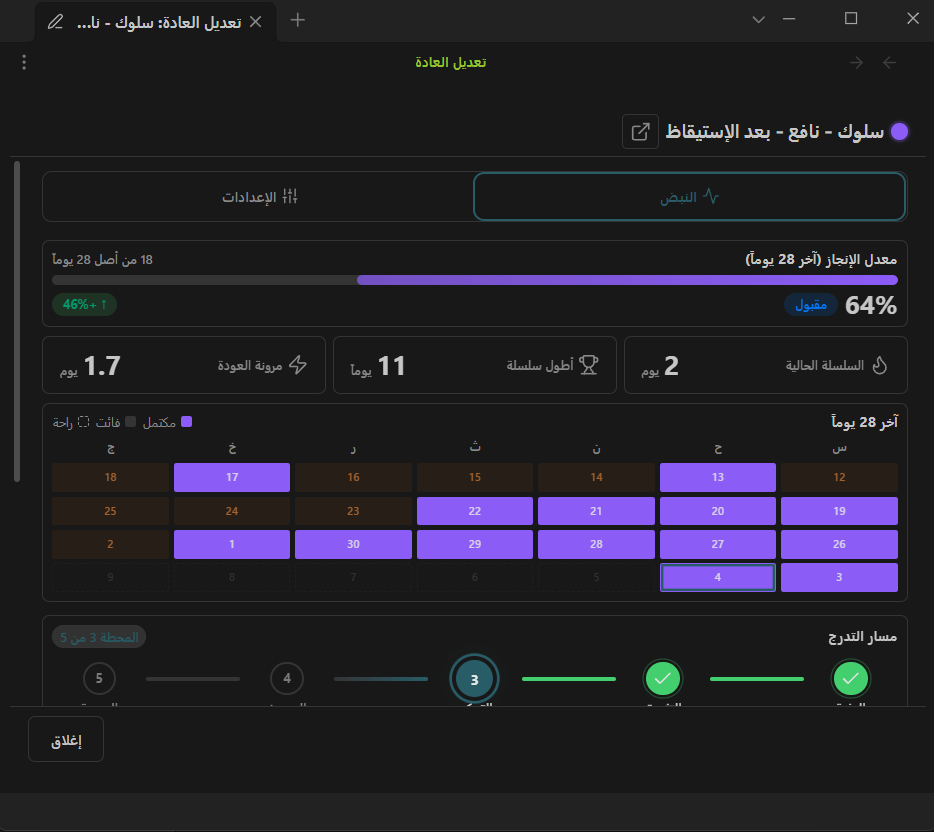
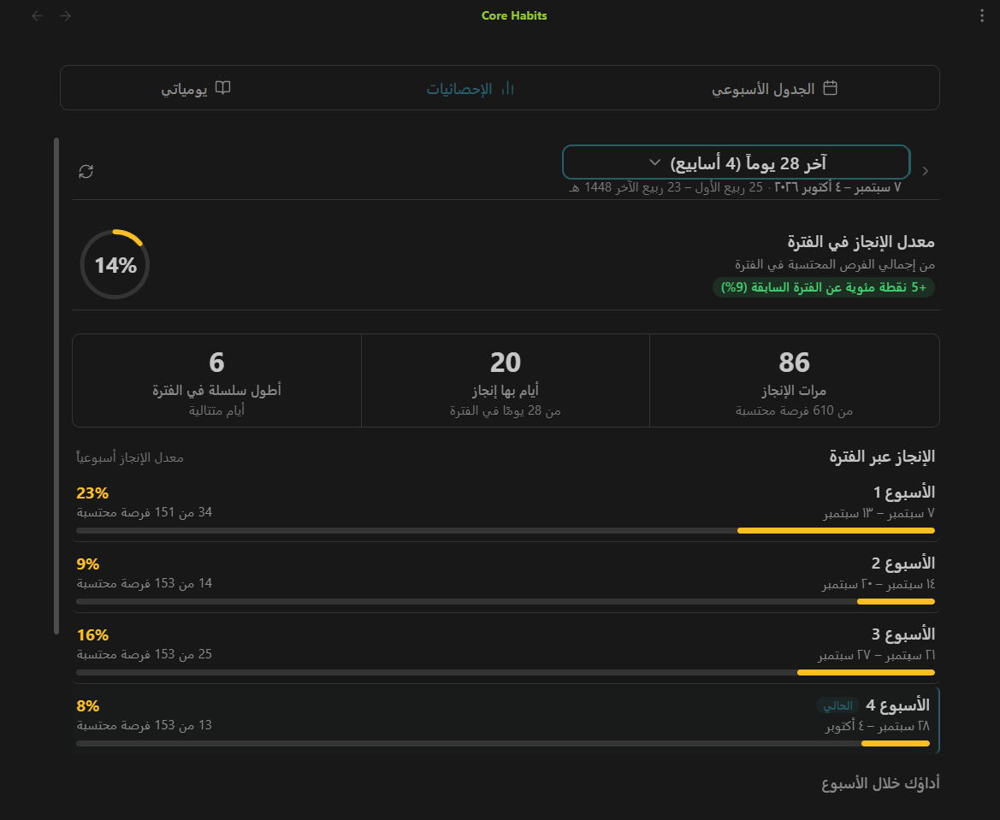
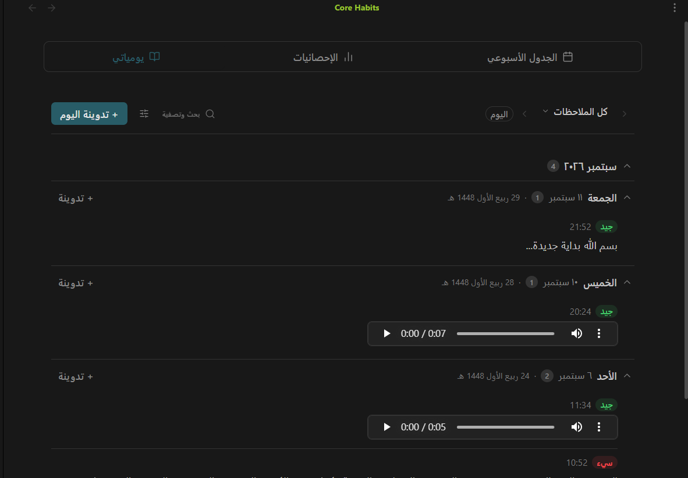
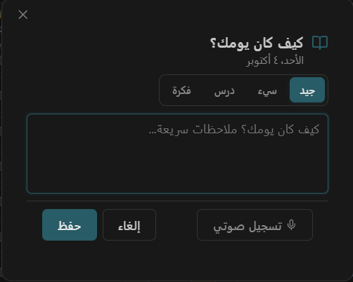

# Core Habits

<p align="center">
  <strong>Track habits visually, reflect in daily notes, and build lasting identity-driven routines.</strong>
</p>

<p align="center">
  
  
  
  
  
</p>

---

**Core Habits** is a native, privacy-first habit tracker for [Obsidian](https://obsidian.md). Built around the principles of atomic habit building and identity transformation, it connects visual weekly tracking directly to your **Daily Notes** and local Markdown files—without databases, subscriptions, or cloud telemetry.



---

## ✨ Key Features

### 📅 Visual Weekly Grid
- **Interactive Checklists**: Seamlessly toggle habit completions for any day of the week.
- **Hierarchy & Habit Grouping**: Organize related habits under parent groups with collapsible rows.
- **Flexible Scheduling**: Customize individual habits for all-days, specific weekdays, or custom intervals.
- **Responsive Layout**: Adapts dynamically from spacious desktop views down to a compact single-pane layout for narrow sidebars and mobile screens.
- **Dual Calendars**: Seamless support for both Gregorian and Hijri calendars with intuitive date navigation.

### 🎯 Identity-Driven Habits & Progression
- **Identity Formulation**: Ground every habit in the person you want to become (*"I am a consistent reader"*).
- **Growth Milestones**: Track progress across multi-tier milestone levels that evolve as your streak solidifies.
- **Habit Pulse**: Detailed 28-day completion heatmap, bounce-back pace (recovery speed), and active streak metrics.



### 📈 Deep Insights & Performance Analytics
- **Reliable Streak Calculation**: Dynamic current and longest streak tracking with configurable missing-note grace policies.
- **Consistency Scoring**: Understand your actual retention score over 4-week rolling periods.
- **Trend Detection**: Instant visual indicators showing whether your consistency is improving, stabilizing, or declining.



### 🎙️ Reflections & Voice Journaling
- **Integrated Daily Diary**: Review all habit logs, reflections, and thoughts alongside your completions.
- **Voice Memos**: Record quick voice reflections using native Web Audio with zero external dependencies.
- **Categorized Insights**: Tag reflections as **Good**, **Bad**, **Lesson**, or **Idea** to spot behavioral patterns over time.

| Reflections & Audio Player | Voice Recording Popup |
|:---:|:---:|
|  |  |

### 🌍 First-Class Bilingual Support
- Built-in, high-polish localization for both **Arabic (RTL)** and **English (LTR)**.
- Layouts, typography, tab bars, icons, and keyboard navigation automatically mirror to match your interface direction.

---

## 🔒 100% Local & Private Architecture

Core Habits believes that your habits and reflections are deeply personal.

- **Vault-Native Data**: Your habit definitions live as clean Markdown notes with standard YAML frontmatter in your chosen habits folder.
- **Daily Notes Integration**: Completions and journal logs are written directly to your Daily Notes via Obsidian's safe `vault.process` API.
- **Zero Telemetry**: No tracking, no external server calls, no third-party cloud.
- **Safe Migrations**: Automatic pre-migration backups created in `.backups/` whenever schema upgrades occur.

---

## 🚀 Installation

### From Obsidian Community Plugins (Recommended)
1. Open Obsidian **Settings** > **Community plugins**.
2. Make sure **Restricted mode** is turned off.
3. Click **Browse** and search for **Core Habits**.
4. Click **Install**, then **Enable**.

### Manual Installation
1. Download `main.js`, `manifest.json`, and `styles.css` from the latest [GitHub Release](https://github.com/Ahmed-Farhat99/core-habits/releases).
2. Create a folder named `core-habits` inside your vault's plugin directory: `<vault>/.obsidian/plugins/core-habits/`.
3. Copy the downloaded files into that folder.
4. Reload Obsidian and enable **Core Habits** under **Community plugins**.

### Via BRAT
If you use the [Obsidian42 - BRAT](https://github.com/TfTHacker/obsidian42-brat) plugin:
1. In Obsidian, open **Settings** > **BRAT** > **Add Beta plugin**.
2. Enter the repository URL: `https://github.com/Ahmed-Farhat99/core-habits`.
3. Click **Add Plugin** and enable Core Habits once installed.

---

## 🛠️ Quick Start

1. **Open the Grid**: Click the calendar icon in your ribbon or run **Core Habits: Open Weekly View** from the Command Palette (`Ctrl+P` / `Cmd+P`).
2. **Create a Habit**: Click **+ Add Habit**, choose a name, pick your theme color, set an identity anchor, and select which days to schedule.
3. **Track Daily**: Click any cell on the grid to mark an activity completed. Check your Daily Note to see the native markdown checklist item updated in real-time.
4. **Reflect**: Click the diary tab or a habit's comment icon to attach voice or written notes to today's accomplishments.

---

## 🧑‍💻 Development

Requirements: **Node.js 20+** and **npm**.

```bash
# Clone the repository
git clone https://github.com/Ahmed-Farhat99/core-habits.git
cd core-habits

# Install dependencies
npm ci

# Run test suite
npm run test:run

# Verify UI CSS architecture rules
npm run ui:check

# Run linter & typecheck
npm run lint
npm run typecheck

# Build production bundle
npm run build

# Run pre-release validation
npm run release:check
```

---

## 📄 License

This project is licensed under the [MIT License](./LICENSE).
